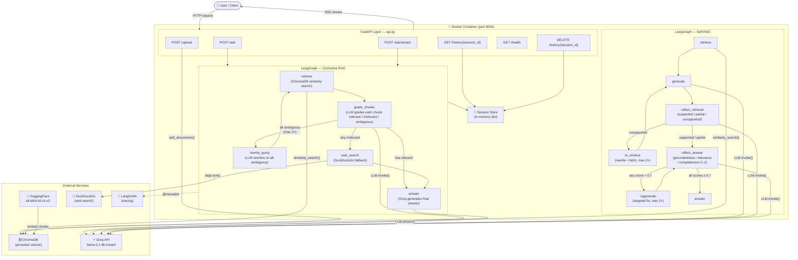

# AgentMind — Production Agentic RAG with LangGraph

## Live Demo

Base URL: http://35.157.189.76:8000

```bash
curl http://35.157.189.76:8000/health

curl -X POST http://35.157.189.76:8000/ask \
  -H "Content-Type: application/json" \
  -d '{"question":"What is corrective RAG?","session_id":"demo"}'
```

AgentMind is a production-grade agentic RAG system that **reasons before retrieving** — it decides what to look up, judges whether the retrieved context is good enough, and loops back to refine its search if it isn't. Built over 10 days as a structured engineering challenge, it progresses from a minimal 3-node state machine to a fully Dockerized REST API with streaming, LangSmith observability, and two distinct RAG strategies: Corrective RAG (CRAG) and Self-RAG with reflection scoring.

## Architecture



## Tech Stack

| Tool | Purpose | File |
|------|---------|------|
| **LangGraph** | State-machine orchestration for all RAG pipelines | `main1.py` – `main8.py` |
| **Groq** `llama-3.1-8b-instant` | LLM inference (grading, rewriting, answering) | all pipeline files |
| **ChromaDB** | Persistent local vector store (5 papers, 738 chunks) | `chroma_db_main4/` |
| **HuggingFace** `all-MiniLM-L6-v2` | Dense embeddings for similarity search | all retrieval nodes |
| **FastAPI** | REST API with SSE streaming and session management | `api.py`, `main7.py` |
| **DuckDuckGo** (`ddgs`) | Web search fallback when retrieval is insufficient | CRAG nodes |
| **LangSmith** | Full observability — traces, latency, token counts | `main6.py`, `tracing.py` |
| **Docker** | Containerized deployment with volume-mounted index | `Dockerfile`, `docker-compose.yml` |

## Project Structure

```
agentmind/
  main1.py          # Day 1  — Minimal 3-node LangGraph pipeline (state machine basics)
  main2.py          # Day 2  — Basic agentic RAG with conditional retrieval routing
  main3.py          # Day 3  — Multi-tool agent: retrieval + web search + calculator
  main4.py          # Day 4  — Corrective RAG (CRAG): chunk grading + web fallback
  main5.py          # Day 5  — Self-RAG: reflection scoring + answer regeneration
  main6.py          # Day 6  — LangSmith tracing on every node with @traceable
  main7.py          # Day 7  — FastAPI entry point; uvicorn startup with ASCII banner
  main8.py          # Day 8  — Terminal streaming: spinner during retrieval, tokens live
  api.py            # Day 7/8 — FastAPI app: CRAG as REST + SSE streaming endpoint
  tracing.py        # LangSmith init and @trace_step decorator
  Dockerfile        # Multi-stage build on python:3.11-slim
  docker-compose.yml # One-command start with volumes + env_file
  requirements.txt  # Pinned dependencies (Linux-compatible)
  architecture.md   # Mermaid system diagram + sequence diagram
  papers/           # Source PDFs indexed into ChromaDB
  .env              # API keys (gitignored)
```

## Results — Self-RAG Reflection Scores (Day 5)

Self-RAG grades every answer on three axes before returning it: **groundedness** (is the answer supported by context?), **relevance** (does it address the question?), and **completeness** (is it thorough?). Scores below 0.7 trigger regeneration (max 2×).

| Question | Retrieval verdict | Re-retrieves | Regenerations | G / R / C | Avg |
|----------|------------------|:---:|:---:|-----------|:---:|
| How does Self-RAG decide when to retrieve? | SUPPORTED | 0 | 1 | 0.90 / 1.00 / 0.80 | **0.90** |
| What is the capital of Germany? | UNSUPPORTED → re-retrieved | 2 | 1 | 0.80 / 1.00 / 0.90 | **0.90** |
| RAG retrieval math formulation | SUPPORTED | 0 | 2 | 0.60 / 0.80 / 0.40 | **0.60** |
| LLM agents multi-step reasoning | PARTIAL | 0 | 0 | 0.80 / 1.00 / 0.80 | **0.87** |

## Installation

### Local

```bash
# 1. Clone
git clone https://github.com/bawilla/agentmind.git
cd agentmind

# 2. Virtual environment
python -m venv venv
# Windows
venv\Scripts\activate
# macOS / Linux
source venv/bin/activate

# 3. Dependencies
pip install -r requirements.txt

# 4. API keys
cp .env.example .env   # then fill in GROQ_API_KEY
```

### Docker (recommended)

```bash
# Build and start (first run ~5 min for torch/transformers)
docker-compose up --build

# Subsequent starts
docker-compose up -d

# Stop
docker-compose down
```

Or pull the pre-built image:

```bash
docker pull jamsonujang/agentmind:latest

docker run -p 8000:8000 \
  --env-file .env \
  -v $(pwd)/papers:/app/papers:ro \
  -v $(pwd)/chroma_db_main4:/app/chroma_db_main4 \
  jamsonujang/agentmind:latest
```

### Required `.env`

```env
# Required
GROQ_API_KEY=your_groq_api_key_here

# Optional — LangSmith tracing (Day 6)
LANGCHAIN_API_KEY=your_langsmith_key
LANGCHAIN_TRACING_V2=true
LANGCHAIN_PROJECT=agentmind
```

## Running

```bash
# Day 1 — minimal pipeline
python main1.py

# Day 5 — Self-RAG with reflection scoring
python main5.py

# Day 7 — start the REST API (http://localhost:8000)
python main7.py

# Day 8 — terminal streaming demo
python main8.py
```

## REST API

Base URL: `http://localhost:8000` · Swagger UI: `/docs` · ReDoc: `/redoc`

### Endpoints

| Method | Path | Description |
|--------|------|-------------|
| `POST` | `/ask` | Run full CRAG pipeline, return JSON |
| `POST` | `/ask/stream` | Run CRAG pipeline, stream SSE tokens |
| `GET` | `/history/{session_id}` | Retrieve session exchange history |
| `DELETE` | `/history/{session_id}` | Clear session history |
| `GET` | `/health` | Liveness check |
| `POST` | `/upload` | Upload a PDF and index it into ChromaDB |

### POST /ask — Request / Response

```bash
curl -X POST http://localhost:8000/ask \
  -H "Content-Type: application/json" \
  -d '{"question": "What is corrective RAG?", "session_id": "demo"}'
```

```json
{
  "answer":       "Corrective RAG improves retrieval quality by...",
  "sources":      ["corrective_rag.pdf:0", "rag_survey.pdf:3"],
  "tool_used":    "retrieval | web_search | both",
  "chunk_grades": {"relevant": 3, "irrelevant": 1, "ambiguous": 1},
  "session_id":   "demo",
  "latency_ms":   1847.3
}
```

### POST /ask/stream — SSE Events

```bash
curl -X POST http://localhost:8000/ask/stream \
  -H "Content-Type: application/json" \
  -d '{"question": "How does CRAG handle irrelevant chunks?", "session_id": "s1"}'
```

```
data: {"type": "status", "message": "Retrieving chunks..."}
data: {"type": "status", "message": "Chunk 1 graded: RELEVANT"}
data: {"type": "token",  "content": "Based"}
data: {"type": "token",  "content": " on"}
...
data: {"type": "done",   "sources": ["corrective_rag.pdf:0"], "tool_used": "both",
       "chunk_grades": {"relevant": 1, "irrelevant": 4, "ambiguous": 0},
       "latency_ms": 33928.0}
```

| Event type | Fields | Description |
|------------|--------|-------------|
| `status` | `message` | Pipeline progress update |
| `token` | `content` | One answer token from the LLM |
| `done` | `sources`, `tool_used`, `chunk_grades`, `latency_ms` | Final metadata |

### POST /upload

```bash
curl -X POST http://localhost:8000/upload \
  -F "file=@papers/my_paper.pdf"
```

## Author

**Jamson Ujang** — MSc Particle Physics | Data Scientist  
GitHub: [@bawilla](https://github.com/bawilla)
