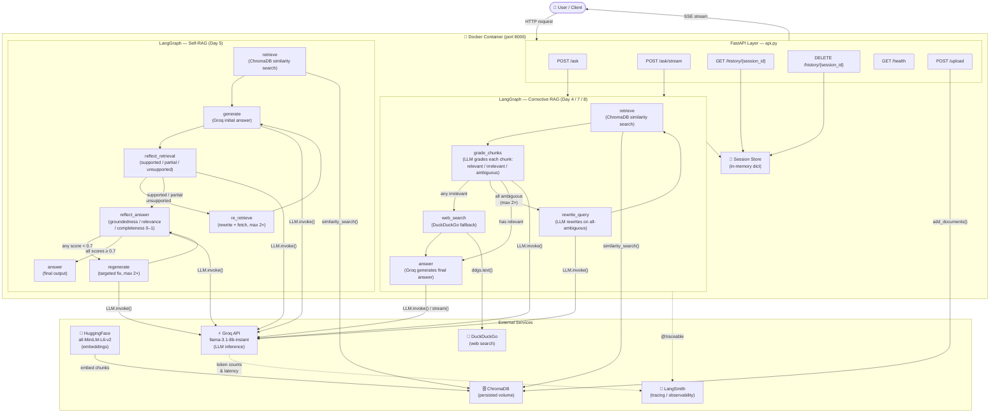
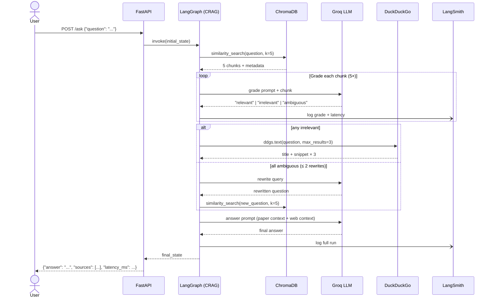

# AgentMind — Architecture

## System Architecture

## Data Flow — Single Request

## Component Responsibilities

| Component | File | Role |
|-----------|------|------|
| FastAPI app | `api.py` | HTTP routing, session management, PDF upload |
| CRAG pipeline | `api.py`, `main4.py` | Corrective retrieval loop with chunk grading |
| Self-RAG pipeline | `main5.py` | Reflection-based answer quality scoring |
| Multi-tool agent | `main3.py` | Routes to retrieval / web search / calculator |
| Tracing utilities | `tracing.py` | LangSmith init, `@trace_step` decorator |
| Streaming | `main8.py` | Terminal spinner + `LLM.stream()` token output |
| Docker entry point | `main7.py` | Uvicorn startup banner |
| Vector store | `chroma_db_main4/` | Persisted ChromaDB index (5 papers, 738 chunks) |
